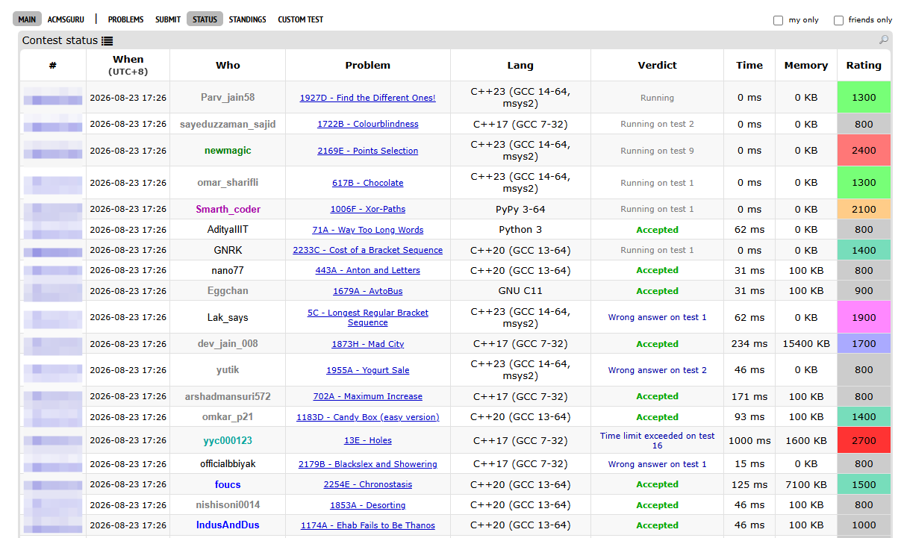
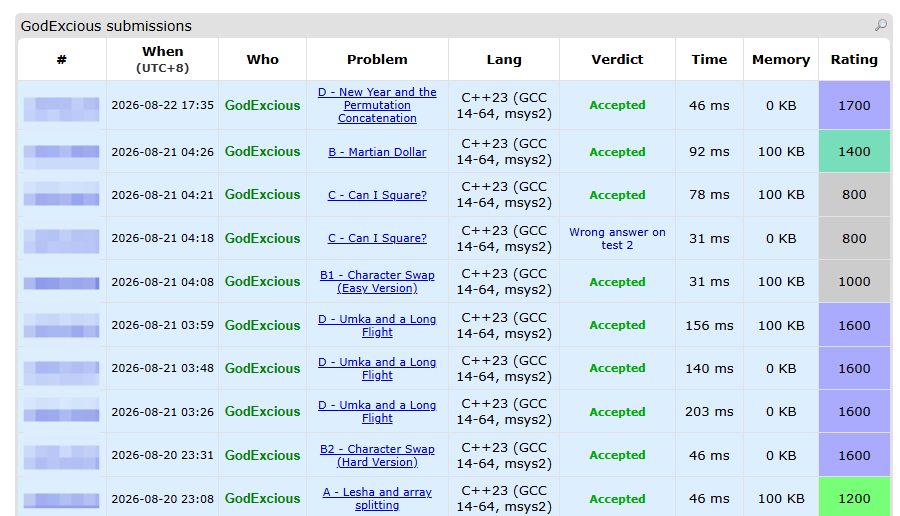
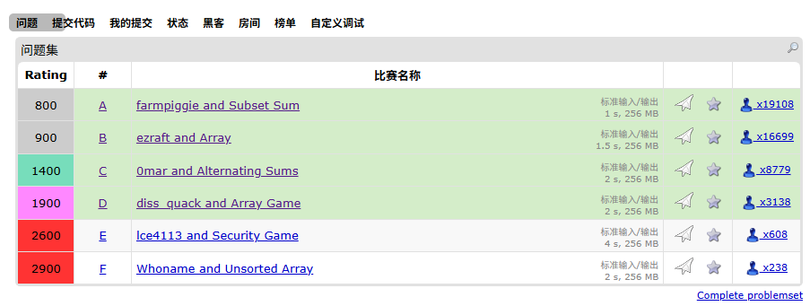
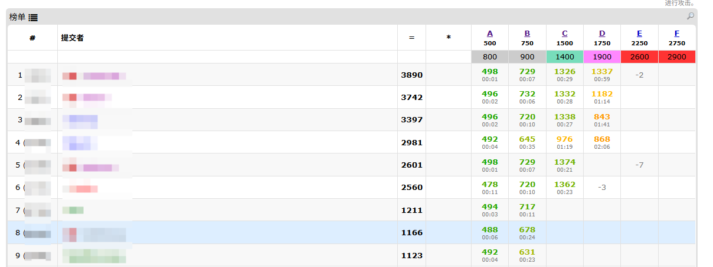
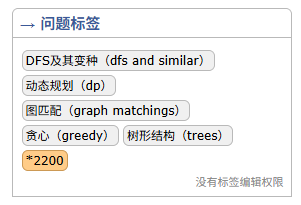

<h1 align="center">CF-Submissions-Ratings</h1>

  <a href="../README.md">English</a> | <strong>简体中文</strong>

  
  
  

一个轻量且高度优化的 Codeforces 油猴（Tampermonkey）脚本，可以在“Status（状态）”和“Submissions（提交记录）”等页面直观、优雅地显示题目的难度分。

## 📸 效果预览

  
   
  <em>Status 页面的分数直显与时间格式化效果</em>

  
   
  <em>完美兼容个人 Submissions 记录自带的背景高亮</em>

  
   
  <em>Contest 题单页面的难度分与 AC 状态展示</em>

  
   
  <em>Contest 排名页面的难度分展示</em>

  
   
  <em>题目页面的 Rating 颜色标签显示</em>

## ✨ 功能特点
- 在 `submissions` 和 `status` 页面直接显示题目的难度分数，优化了时间格式化和表格布局。
- 优化了 `contest` 页面的难度分展示和 AC 状态展示。
- 优化了 `hacks` 页面的难度分展示。
- 在题目页面的 `problem tag` 中增加了题目 rating 的颜色显示。
- 题目分数数据通过 Codeforces 官方 API 获取，每天仅在本地更新一次缓存，不会发送过多的网络请求。
## 🚀 安装说明
1. 首先，在你的浏览器上安装 [Tampermonkey (油猴)](https://www.tampermonkey.net/) 脚本管理器。
2. 点击下方链接一键安装脚本：
   
   👉 **[点击安装 cf-submission-ratings](https://raw.githubusercontent.com/GodExious/CF-Submissions-Ratings/main/cf-submission-ratings.user.js)**

   > *注：如果你已经 clone 了本仓库，也可以手动将 `cf-submission-ratings.user.js` 的代码复制到油猴新建的脚本中。*

3. 打开或刷新 Codeforces 的任意 Status 页面，享受难度直显带来的刷题快感！

## 💡 意见与反馈
如果你对本插件有任何好点子、改进建议，或者发现了 Bug，非常欢迎到 [GitHub Issues](https://github.com/GodExious/CF-Submissions-Ratings/issues) 中提出反馈与讨论！也随时欢迎提交 Pull Requests。

## 👏 鸣谢
本插件主要受到 [Codeforces-Helper](https://chromewebstore.google.com/detail/codeforces-helper/ahoeafmlmoohkkalcickdnkifpfnolpj) 的启发。由于该插件不支持在 `status` 页面展示题目分数，因此我让 AI (Antigravity 1.23.2) 帮我仿写并实现了本项目。

## 📄 License
本项目基于 [MIT License](../LICENSE) 协议开源。
